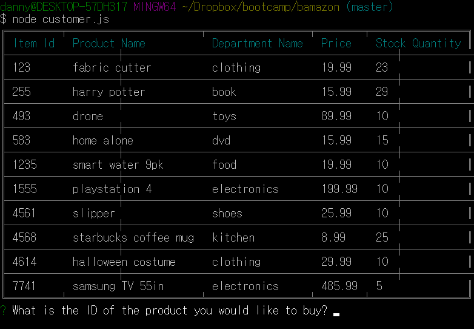
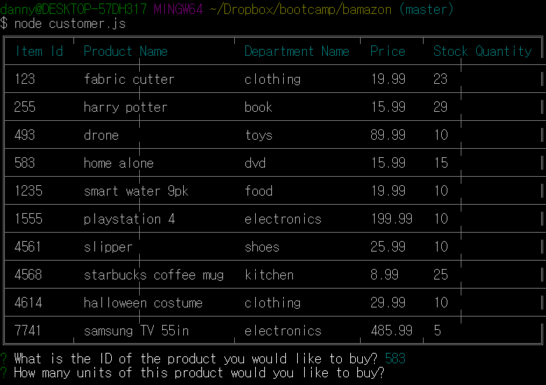
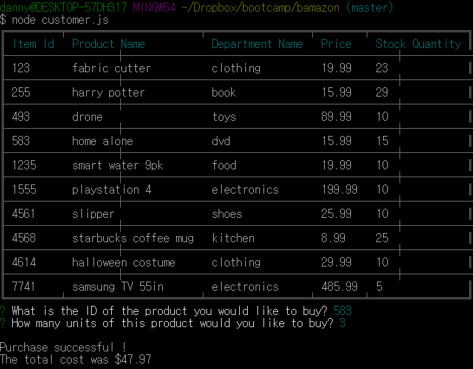
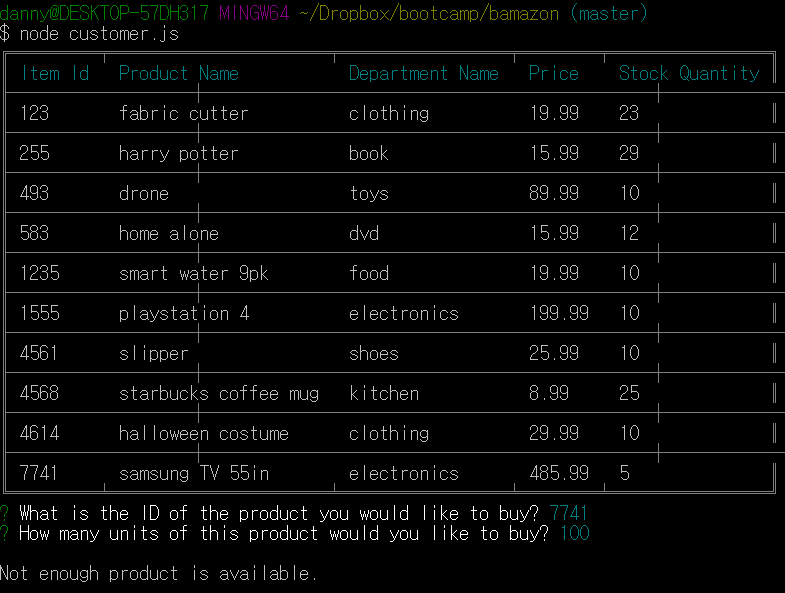

# Bamazon

Bamazon is an Amazon-like storefront with the MySQL skills.
The app will take in orders from customers and deplete stock from the store's inventory.

### Bamazon Customer View
***

The app first ask customers the ID of the product they would like to buy. 

***

Then the app ask how many units of the product they would like to buy.

***

If enough stock of that product was available, it shows the total cost of purchase.

***

If the stock of that product was not enough, it shows that not enough is available.

